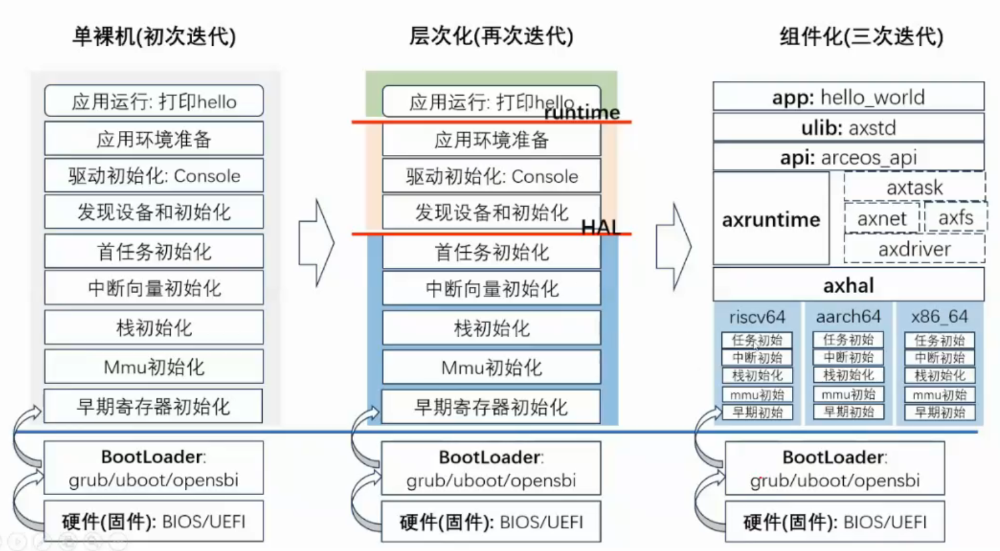
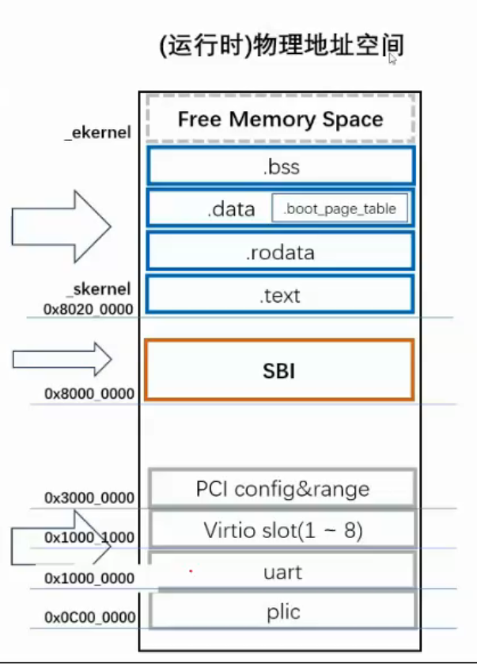
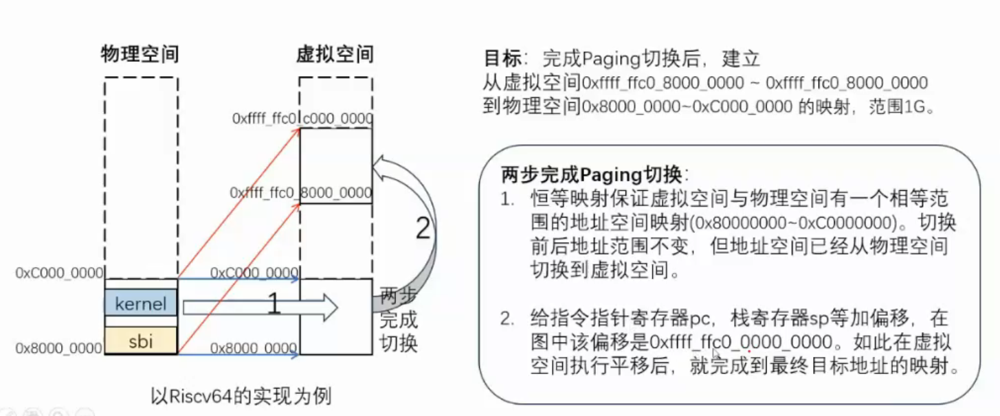
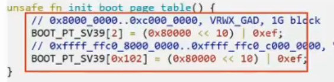
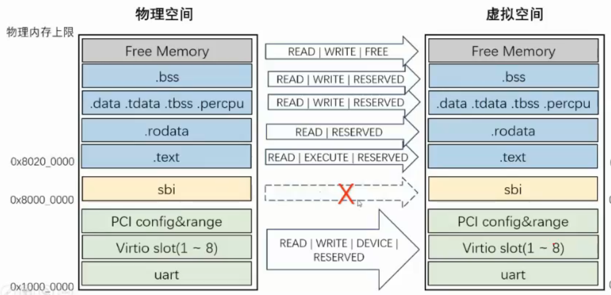
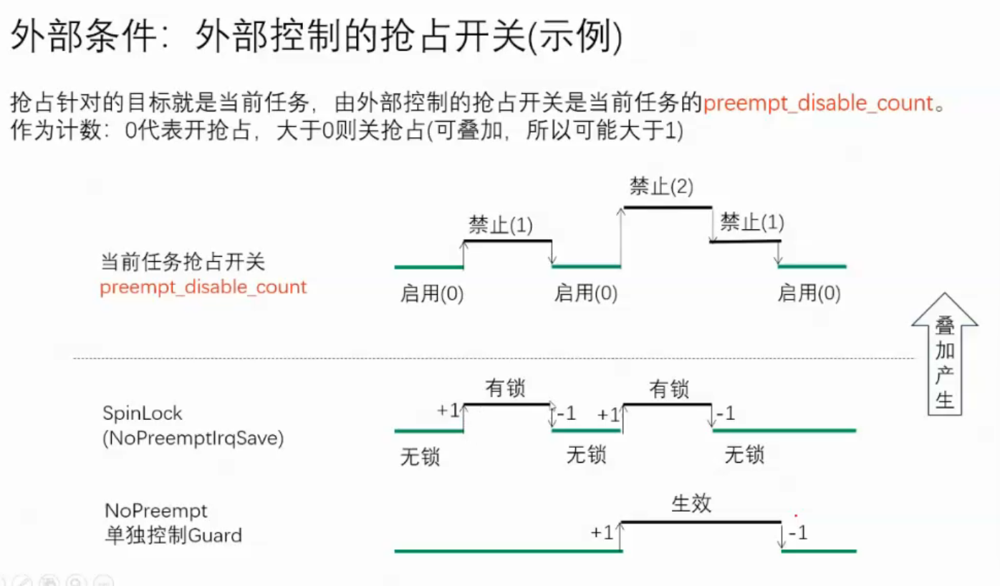

# 微内核

宏内核内核空间和用户空间分开。

微内核只有内核空间，只有内核态，os以库的形式存在。单一应用。

# 组件化

rust中的crate。

组件化os：按需组装成不同的os。

# 内存管理

## 地址空间

三级页表。SV39。

底层的页表和PTE的各种设置要根据架构设计，向上提供一个架构无关的统一接口。

## 分页

- 早期恒等映射，只映射一部分（1G）

- 阶段2 重建映射（可选）

根据feature指定，可以建立完整的映射。取消sbi映射进行保护，底层的设备空间和上层进行细粒度控制。

## 内存分配

全部空间给页分配器 页分配器分配一些页给字节分配器用

# 协作式调度

只有线程。

根据feature，判断是否需要激活spawn函数。

如果激活：

- idle：调度用的，持续让出cpu，如果没有其他任务就进入待机状态

# 抢占式

时间片，外部条件

我的理解：时间片代表着它可以被抢占，但是内部可能存在一些临界区资源，可能造成死锁，所以由两个条件叠加形成抢占的总条件。（感觉如果做了死锁检测就不需要两个条件了吧）

# ArceOS总结

单应用OS，功能实现的细节和普通OS差不多，就是根据feature可以组装组件，必须按需选择不同架构对应的底层实现。大概就是分成接口、组装器、底层实现三个部分，接口是统一的，组装器根据feature选择底层实现，底层实现可能是不同架构的同类行为/不同分配或者算法。
