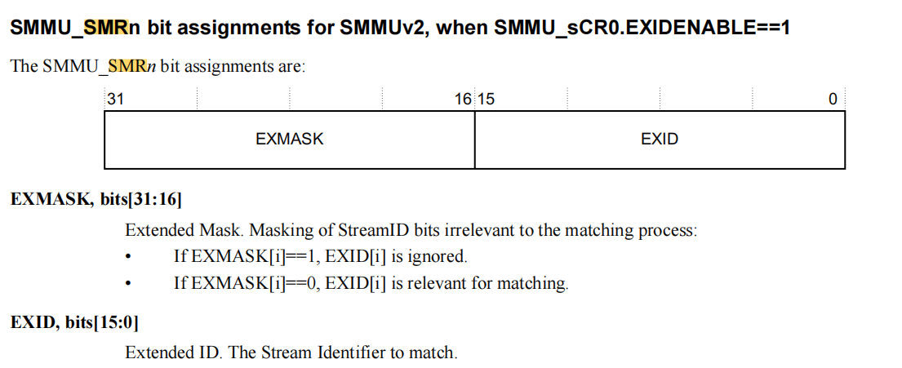
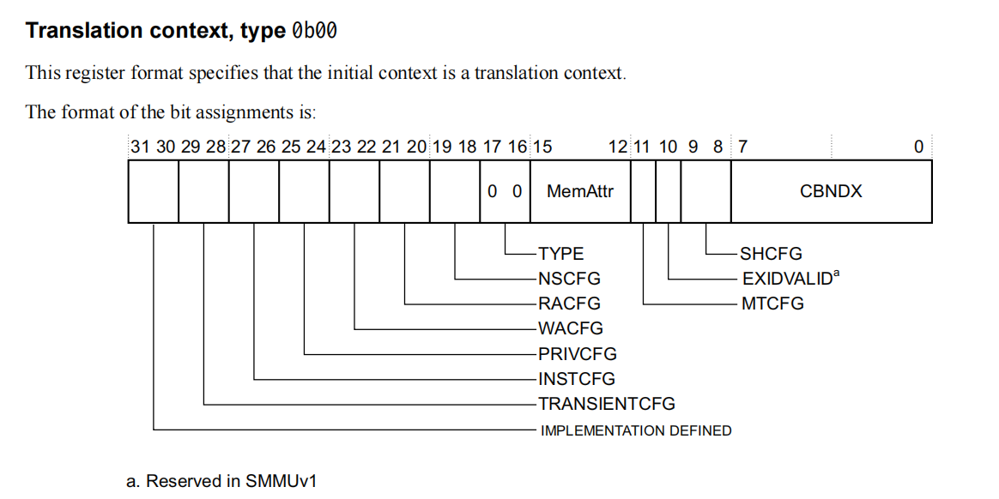

# SMMUV2

每个设备的操作都带有sid，smmu根据sid进行地址翻译

sid用来找smr寄存器，如果找到了smr寄存器，就去对应的s2cr中找context bank，contextbank是用来进行地址翻译的，有点像v3页表里面的STE。

IDR0寄存器里面说明了最多支持几对寄存器用来翻译。

配置过程：对于sid，找到可用的smr s2cr对，再找contextbank，在里面设置好相应的页表结构，把contextxbank index写入s2cr

# SMRn



smr寄存器里面的mask和id是用来确定sid的。

# S2CRn



CBNDX是context区域的索引，也可以用于CBARn，里面是关于对应的contextbank的属性

# contextbanks

一段内存区域，每个项占据4k或64k，每一项里面有转换表的基地址，和对应的属性等等。

所以页表的概念应该是这个contextbank所指的基地址的一段内存空间。

每个cb对应一个cbar，type字段描述它的性质，用来s1还是s2翻译

# SmmuDesc

```
pub struct SmmuDesc {
    pub base: usize,
    pub interrupt_id: usize,
    pub global_mask: u16,
}
```

# 寄存器定义register_structs!

- SmmuGlbRS0：包括了IDR0-7寄存器，说明支持七对
- SmmuGlbRS1
- SmmuContextBank：一段内存区域，类似页表

# SmmuV2

```
struct SmmuV2 {
    glb_rs0: &'static SmmuGlbRS0,
    glb_rs1: &'static SmmuGlbRS1,
    context_s2_idx: usize,
    context_bank: Vec<DeviceRef<'static, SmmuContextBank>>,
    context_alloc_bitmap: Option<FlexBitmap>,

    smr_num: usize,
    smr_alloc_bitmap: Option<FlexBitmap>,
    group_alloc_bitmap: Option<FlexBitmap>,
}

static SMMU_V2: spin::Once<Mutex<SmmuV2>> = spin::Once::new();

pub fn smmu_init() {
    SMMU_V2.call_once(|| Mutex::new(SmmuV2::new()));
}
```

# 初始化

IDR1中找到的信息：

- pagesize
- 多少个page

contexts的起始地址 smmu_base+pagesize*num

- context bank的数量
- stage-2的contexts的数量

插入context banks，把context banks分成两个部分，vm用的，hvsr用的。

IDR0中找到信息：

- smr的数量(每个设备可以占用一个)

分组（暂时不太懂）

清空错误处理寄存器

CR0寄存器中31位开启vmid16位，30位开启hyp模式，12位指定TLB维护方式（不懂）

# 方法合集

- 某smr是否分组了
- 通过smr号获取cbndx
- 通过smr确定sid
- 通过smr确定掩码
- 分配一个smr的序号
- 往smr里面写
- 往s2cr里面写
- 分配一个contextbank
- 往contextbank里面写

# 开放方法

- 初始化smmuv2 （lazy static）
- 为一个vm分配一个contextbank
- 往smmu里面注册设备，给出contextid和sid

# 检查环境

- smmu的版本是不是支持
- 支持matching还是indexing
- 支持s2 / s1+s2


- 一致性遍历页表：使用页表的同步问题
- 检测TLB广播：是否支持TLB维护广播机制
- 对4KB页面支持
- 比较pa和ipa的大小：smmu支持pa和ipa必须大于cpu支持的大小，否则代表着smmu无法使用全部地址空间
