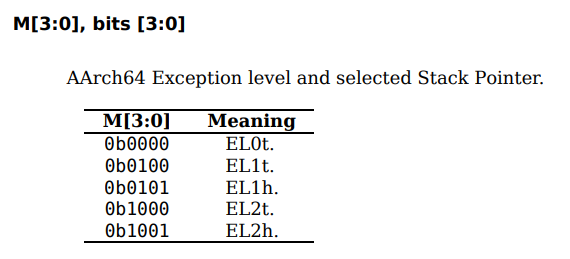
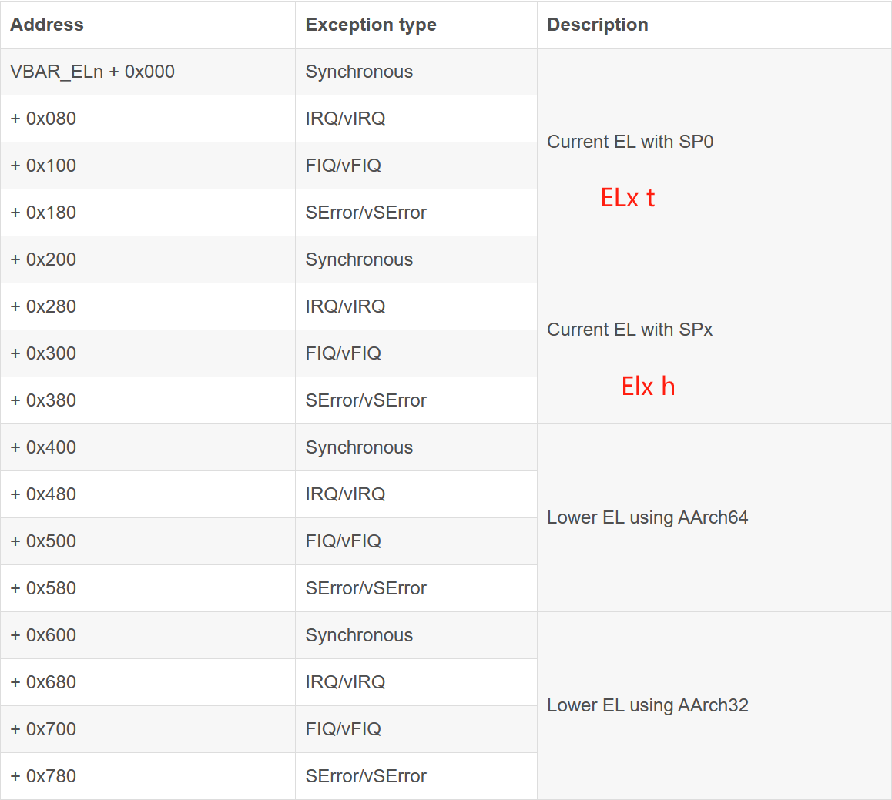

# 异常等级

- EL0：非特权模式，app
- EL1：特权模式，os
- EL2：hypervisor
- EL3：安全模式 secure monitor

# 特权级的切换

低级到高级，处理异常，eret返回低级。

# 分类

同步异常/异步异常（中断）

同步：

- 系统调用：svc（el0->el1），hvc(el1->el2)，smc(el2->el3)
- mmu
- sp和pc对齐问题
- 未分配指令

异步：

- IRQ中断（普通中断）
- FIQ中断
- SError

# 异常入口

异常发生后，cpu自动做的：

- PSTATE：状态保存到SPSR_ELx （x是要切换到的等级）
- 返回地址 ELR_ELx
- PSTATE的DAIF域设置为1，把调试一场、系统错误、IRQ、FIQ中断都关闭了
- 更新ESR_ELx，异常原因
- SP执行SP_ELx，SP自动切换到对应等级的栈顶
- 切换到对应EL，跳转异常向量表执行

os要做的：

保证SP_ELx是正确的，构建异常向量表

# 异常返回

eret语句

- 从ELR_ELx中恢复PC
- 把SPSR_ELx恢复为处理器的状态

如果是函数调用，ret返回到x30的地址

# 异常处理的路由

- 处理异常的等级>=当前等级（除了EL0）
- 同步异常自己处理
- 异步异常可以去不同等级 通过设置SCR HCR寄存器

# 栈

栈必须是16字节对齐。在初始化的时候就建立了栈空间了。

# 执行模式64/32

HCR_EL2.RW字段记录了EL0切换到EL1，EL1要运行在哪个模式。

1表示64.  0表示32

关于SPSR以EL2为例，要从EL2返回

SPSR_EL2.M[3:0]记录了返回到哪个EL

M[4]记录了目标EL的执行模式，0表示64，1表示32.

# e.g. 从EL2陷入EL1

可以视为此时是EL1->EL2，将要返回到EL1，使用eret指令。

所以设置一些和EL2有关系的寄存器，ELR_EL2记录EL1的返回地址，SPSR_EL2的低4位记录返回到哪个等级，设置为EL1h

# 异常向量表vector table

- 每个等级都有自己的表，除了EL0，因为它必须去其他特权级处理异常
- 基地址放在VBAR_ELx 寄存器（低11位保留，要求基地址2k对齐）
- 每个表项128字节对齐（7）
- EL1t和EL1h的区别是，同级别处理异常，使用的栈如果是EL0的栈，就是ELt
- 

# ESR_ELx

异常综合信息寄存器，解析异常的原因。

# FAR

保存了发生异常时候的虚拟地址
